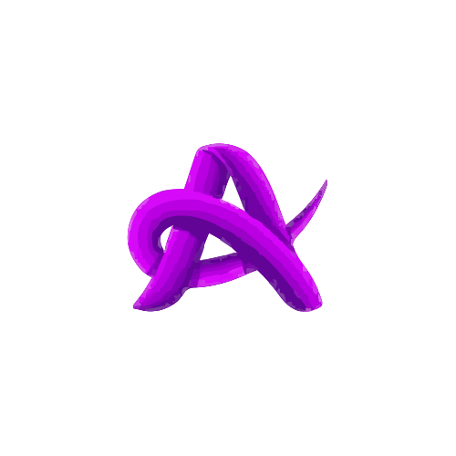

<a name="readme-top"></a>

  <!-- PROJECT SHIELDS -->

[![Contributors][contributors-shield]][contributors-url]
[![Forks][forks-shield]][forks-url]
[![Stargazers][stars-shield]][stars-url]
[![Issues][issues-shield]][issues-url]
[![MIT License][license-shield]][license-url]
[![LinkedIn][linkedin-shield]][linkedin-url]

  <!-- PROJECT LOGO -->

  <br />
  <div align="center">
    <a href="https://github.com/Sheeanu/My-Portfolio">
      
    </a>
    <h1 align="center">AnushriHere.me</h1>
    <p align="center">
    <br/>
Crafting Connections through Code: Explore my journey, projects, and passions in this immersive portfolio powered by React.<br/>
      <br/>
      Built by: Anushri Pramanik
      <br/>
      <br/>
      <a href="https://github.com/Sheeanu/My-Portfolio"><strong>Explore the docs »</strong></a>
      <br/>
      <br/>
      <a href="https://AnushriHere.me">View Live Website</a>
      ·
      <a href="https://github.com/Sheeanu/My-Portfolio/issues">Report Bug</a>
      ·
      <a href="https://github.com/Sheeanu/My-Portfolio/issues">Request Feature</a>
    </p>
  </div>
  
  <!-- TABLE OF CONTENTS -->

  <details>
    <summary>Table of Contents</summary>
    <ol>
      <li>
        <a href="#about-the-project">About The Project</a>
        <ul>
          <li><a href="#photos">Photos</a></li>
          <li><a href="#built-with">Built With</a></li>
          <li><a href="#description">Description</a></li>
        </ul>
      </li>
      <li>
          <a href="#getting-started">Getting Started</a>
        <ul>
          <li><a href="#prerequisites">Prerequisites</a></li>
          <li><a href="#installation">Installation</a></li>
        </ul>
      </li>
      <li><a href="#license">License</a></li>
      <li><a href="#questions">Questions</a></li>
    </ol>
  </details>
  
  <!-- ABOUT THE PROJECT -->
  
  ## About The Project
  
  ### Photos
  
[![My React Portfolio Screen Shot][product-screenshot]](https://AnushriHere.me/)

[![My React Portfolio Screen Shot][product-screenshot2]](https://AnushriHere.me/)

[![My React Portfolio Screen Shot][product-screenshot3]](https://AnushriHere.me/)

  <p align="right"><a href="#readme-top">back to top</a></p>
  
  ### Built With
  
  

  <p align="right"><a href="#readme-top">back to top</a></p>
  
  ### Description
  
Feel free to explore and use the code in this basic web portfolio as a starting point for your own projects.

<h3>TL;DR</h3>
Feel free to fork this repo for your own purposes, give it a start if you fork it.

  <p align="right"><a href="#readme-top">back to top</a></p>

<!-- GETTING STARTED -->

## Getting Started

To get a local copy up and running follow these simple example steps.

### Prerequisites

- npm
  ```sh
  npm install npm@latest -g
  ```

### Installation

1. Clone the repo
   ```sh
   git clone https://github.com/Sheeanu/My-Portfolio.git
   ```
2. Install NPM packages
   ```sh
   npm install
   ```

  <p align="right"><a href="#readme-top">back to top</a></p>
  
 
  <!-- LICENSE -->

## License

Distributed under the MIT License. See `LICENSE.md` for more information.

  <p align="right"><a href="#readme-top">back to top</a></p>
  
  
<!-- QUESTIONS -->
  
## Questions

If you have any inquiries, don't hesitate to reach out to me via socials or by sending an email to <a href="mailto:AnushriPramanik22@gmail.com">AnushriPramanik22@gmail.com</a>

<a href="https://www.linkedin.com/in/anushri-pramanik/">LinkedIn</a> | <a href="https://github.com/Sheeanu/">GitHub</a>

Project Link: [https://github.com/Sheeanu/My-Portfolio](https://github.com/Sheeanu/My-Portfolio)

  <p align="right"><a href="#readme-top">back to top</a></p>
  
  <!-- MARKDOWN LINKS & IMAGES -->

[contributors-shield]: https://img.shields.io/github/contributors/Sheeanu/My-Portfolio.svg?style=for-the-badge
[contributors-url]: https://github.com/Sheeanu/My-Portfolio/graphs/contributors
[forks-shield]: https://img.shields.io/github/forks/Sheeanu/My-Portfolio.svg?style=for-the-badge
[forks-url]: https://github.com/Sheeanu/My-Portfolio/network/members
[stars-shield]: https://img.shields.io/github/stars/Sheeanu/My-Portfolio.svg?style=for-the-badge
[stars-url]: https://github.com/Sheeanu/My-Portfolio/stargazers
[issues-shield]: https://img.shields.io/github/issues/Sheeanu/My-Portfolio.svg?style=for-the-badge
[issues-url]: https://github.com/Sheeanu/My-Portfolio/issues
[license-shield]: https://img.shields.io/github/license/Sheeanu/My-Portfolio.svg?style=for-the-badge
[license-url]: https://github.com/Sheeanu/My-Portfolio/blob/main/LICENSE.md
[linkedin-shield]: https://img.shields.io/badge/-LinkedIn-black.svg?style=for-the-badge&logo=linkedin&colorB=555
[linkedin-url]: https://linkedin.com/in/Sheeanu

  <!-- UPDATE PLACEHOLDER IMAGES HERE -->

[product-screenshot]: src/images/screenshot.jpg
[product-screenshot2]: src/images/screenshot2.jpg
[product-screenshot3]: src/images/screenshot3.jpg
